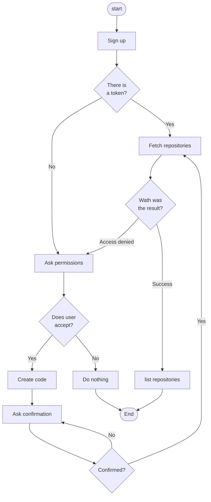

# GitHub GrapQL exercise

This is an exercise (**!!!NON SUITABLE FOR PRODUCTION!!!**) with :
- ReactJS (using only Local Storage)
- GitHub OAuth ([App Devices flow](https://docs.github.com/es/developers/apps/building-oauth-apps/authorizing-oauth-apps#device-flow))
- GitHub GraphQL ([querying viewer repositories](https://developer.gITHUB.com/v4/object/user/))

## Configuring

Prerequisites:
- A GitHub [email confirmed account](https://docs.github.com/en/get-started/signing-up-for-github/verifying-your-email-address)
- Node JS > 16

In order to get this SPA working, is required fulfill these steps:
1. Register the App as mentioned in [here](https://docs.github.com/es/developers/apps/managing-oauth-apps/modifying-an-oauth-app) (IMPORTANT: make sure you **Enable Device Flow**)
2. Take the Client ID from your App created in step 1 and paste it on `src/config.js`
3. Install the dependencies running `npm install`
4. Run the project in development mode (currently the only way because this is just an excercise) `npm start`

## Work flow

1. Login proccess: Just a initial screen, you can create multilple users. Credentials are stored in local without protection (Again! this app is **NON SUITABLE FOR PRODUCTION**).
2. Once you log in: The App is going to ask for permissions in your GitHub Account using the OAuth process, once the app get your permission, automatically it will fetch your repos list availables (yours and shared wit you).
3. The application stores the autorization token when you grant permissions to it following the the flow described here, and reuse it the next time you login, but if it receives an authorization error on fetching repos, automatically it is going to ask permissions again.
4. Listed, the repos presents two icons the firsone is show if it is a public or a private repo and the second lets you mark as favorite (favorites are move to the top of the list over non favorites).
5. Logout is done reloading the page.
 

